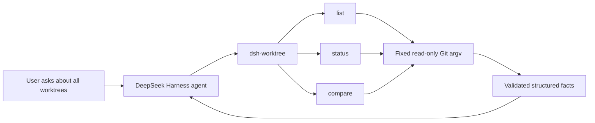

# dsh-lab

[](https://github.com/pengkodam/dsh-lab/actions/workflows/ci.yml)
[](https://github.com/pengkodam/dsh-lab/releases/latest)
[](./LICENSE)

**A production-grade laboratory for extending [DeepSeek Harness](https://github.com/deepseek-ai/deepseek-harness) without forking its core.**

Harness is built around the idea that everything is a plugin. This repository explores what a trustworthy out-of-tree plugin should look like: narrow authority, machine-readable contracts, explicit safety boundaries, packed-artifact acceptance, and cross-platform release evidence.

The first stable release is [`dsh-worktree`](./plugins/dsh-worktree/README.md), a read-only worktree-intelligence plugin.

## dsh-worktree 1.0.0

`dsh-worktree` gives a Harness agent structured visibility across every Git worktree associated with the repository from which it was launched.

| Tool | What it answers |
| --- | --- |
| `git_worktree_list` | Which worktrees exist, and which one is primary? |
| `git_worktree_status` | Which worktrees have staged, unstaged, untracked, conflicted, or locally known upstream work? |
| `git_worktree_compare` | How does each linked HEAD differ from the primary worktree's captured HEAD? |

All three tools take zero arguments. The model cannot supply a path, revision, executable, or Git option. The plugin never fetches, checks out, stages, commits, merges, rebases, or deletes.

## 60-second demonstration

Prerequisites: Node `22.19+` or `24+`, Git, GitHub CLI, and a compatible `dsh` installation. Version 1.0.0 was acceptance-tested with DeepSeek Harness `0.1.0-rc.6`.

```powershell
git clone https://github.com/pengkodam/dsh-lab.git
cd dsh-lab

gh release download v1.0.0 --repo pengkodam/dsh-lab --pattern dsh-worktree-1.0.0.tgz
dsh plugin --profile worktree-demo add ./dsh-worktree-1.0.0.tgz
dsh plugin --profile worktree-demo add @deepseek-ai/dsh-headless@0.1.0-rc.6
dsh --profile worktree-demo --dump-config

node scripts/create-demo-fixture.mjs .acceptance-demo-readme
cd .acceptance-demo-readme/main
dsh --profile worktree-demo "Inspect every worktree in this repository. Tell me which ones have uncommitted work, how their committed changes differ from the primary worktree, and what I should review first."
```

The final command requires `DEEPSEEK_API_KEY` to already be set in the environment. Its prompt is:

> Inspect every worktree in this repository. Tell me which ones have uncommitted work, how their committed changes differ from the primary worktree, and what I should review first.

The generated fixture has deterministic facts that make tool selection easy to verify:

- two worktrees: primary `main` and linked `feature/demo`;
- one untracked file in `main`;
- a clean `feature/demo` worktree;
- `feature/demo` one commit ahead of the primary HEAD; and
- one committed file, `feature.txt`, in that comparison.

An evidence-backed answer should report those facts, distinguish uncommitted state from committed history, and avoid claiming the branch is safe to merge.

## How it fits



The plugin is deliberately smaller than the host. Harness owns the model loop, tool registry, profiles, sessions, and interaction surface; `dsh-worktree` contributes one bounded repository capability through the public composition boundary.

## Safety and proof

- Git is invoked directly with fixed argument arrays and no shell.
- Every process receives `LC_ALL=C` and `GIT_OPTIONAL_LOCKS=0`.
- Execution is cancellable, deadline-bound, and buffer-limited.
- Machine-format output is fully validated before canonical data is returned.
- Diagnostics are sanitized and capped.
- Real-repository tests compare refs, worktree files, and index bytes before and after inspection.
- The package has no runtime or test dependencies.

Release evidence:

- [v1.0.0 release and verified tarball](https://github.com/pengkodam/dsh-lab/releases/tag/v1.0.0)
- [49-test Windows/Ubuntu CI matrix](https://github.com/pengkodam/dsh-lab/actions/workflows/ci.yml)
- [packed-artifact and Harness acceptance record](./V1_ACCEPTANCE.md)
- [completed release checklist](./V1_RELEASE_CHECKLIST.md)

## Compatibility

| Component | Validated version |
| --- | --- |
| Node.js | `22.19.0`, `24` |
| Operating systems | Windows, Ubuntu |
| DeepSeek Harness | `0.1.0-rc.6` |
| Local Git acceptance baseline | `2.39.1.windows.1` |

DeepSeek Harness is in developer preview and explicitly permits compatibility-breaking changes. Re-run the packed installation and live acceptance gates after every Harness upgrade.

## Repository map

- [`plugins/dsh-worktree`](./plugins/dsh-worktree/README.md) — package, runtime, tests, and detailed usage
- [`V1_PRD.md`](./V1_PRD.md) — product and demonstration contract
- [`V1_TECHNICAL_SPEC.md`](./V1_TECHNICAL_SPEC.md) — schemas, Git operations, safety model, and test strategy
- [`V1_RELEASE_CHECKLIST.md`](./V1_RELEASE_CHECKLIST.md) — sequenced build and release gates
- [`V1_ACCEPTANCE.md`](./V1_ACCEPTANCE.md) — local, CI, package, and live Harness evidence
- [`scripts`](./scripts) — reproducible fixture and acceptance utilities

## Local verification

```powershell
cd plugins/dsh-worktree
node --test
npm pack --dry-run
```

## License

This repository, including `dsh-worktree`, is available under the [MIT License](./LICENSE).
